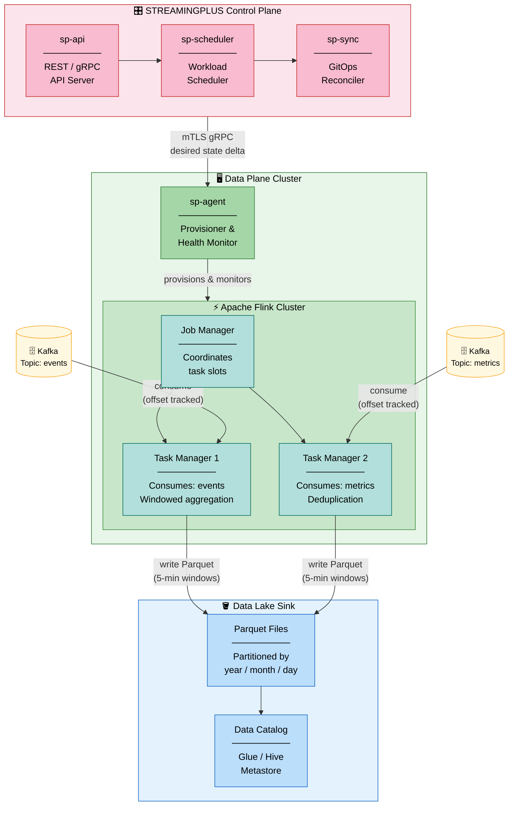

# Architecture

This page describes the internal architecture of STREAMINGPLUS — the components that make up the control plane, how the data plane agents communicate with them, and how multi-cluster topologies are structured.

---

## Overview

STREAMINGPLUS is built on a **hub-and-spoke model**. The control plane is the hub: it maintains desired state, evaluates policy, schedules work, and drives the GitOps reconciliation loop. Data plane agents are the spokes: they run inside each target cluster, receive instructions from the control plane, and provision real streaming infrastructure.

```
┌───────────────────────────────────────────────────────────────────────┐
│                        CONTROL PLANE CLUSTER                           │
│                                                                       │
│  ┌─────────────┐   ┌───────────────┐   ┌──────────────────────────┐  │
│  │  sp-api     │   │ sp-scheduler  │   │  sp-policy  (OPA)        │  │
│  │  REST/gRPC  │──▶│  Workload     │──▶│  Policy evaluation       │  │
│  │  API Server │   │  Scheduler    │   │  Admission webhook       │  │
│  └──────┬──────┘   └───────────────┘   └──────────────────────────┘  │
│         │                                                             │
│  ┌──────▼──────┐   ┌───────────────┐   ┌──────────────────────────┐  │
│  │  sp-store   │   │  sp-sync      │   │  sp-metrics              │  │
│  │  (etcd)     │   │  GitOps       │   │  Metrics Collector       │  │
│  │  State DB   │◀──│  Reconciler   │   │  Prometheus scraper      │  │
│  └─────────────┘   └───────────────┘   └──────────────────────────┘  │
│                                                                       │
└───────────────────────────────┬───────────────────────────────────────┘
                                │  mTLS gRPC
              ┌─────────────────┼─────────────────┐
              │                 │                 │
┌─────────────▼──────┐  ┌───────▼────────┐  ┌────▼──────────────────┐
│  DATA PLANE        │  │  DATA PLANE    │  │  DATA PLANE            │
│  Cluster: prod-us  │  │  Cluster: prod │  │  Cluster: on-prem-1    │
│                    │  │  -eu           │  │                        │
│  ┌──────────────┐  │  │ ┌───────────┐ │  │  ┌──────────────────┐  │
│  │  sp-agent    │  │  │ │ sp-agent  │ │  │  │  sp-agent        │  │
│  │  DaemonSet   │  │  │ │ DaemonSet │ │  │  │  DaemonSet       │  │
│  └──────────────┘  │  │ └───────────┘ │  │  └──────────────────┘  │
│                    │  │               │  │                        │
│  Kafka / Kinesis   │  │  Pub/Sub      │  │  On-prem Kafka         │
└────────────────────┘  └───────────────┘  └────────────────────────┘
```

---

## Example: Kafka → Flink → Data Lake Pipeline

The diagram below shows a common production topology: events flow from a **Kafka source** through an **Apache Flink** processing cluster and land in a **Data Lake sink** (e.g., S3 or GCS). STREAMINGPLUS manages the full lifecycle — provisioning topics, deploying the Flink job, configuring the sink, and monitoring throughput — from a single control plane.



**How it works:**

1. **Source** — Two Kafka topics (`events`, `metrics`) are registered as pipeline sources. STREAMINGPLUS monitors consumer lag and emits alerts when lag exceeds configured thresholds.
2. **Flink cluster** — `sp-agent` provisions the Flink cluster on the data plane and submits the job JAR defined in the `Pipeline` resource. The Job Manager coordinates task distribution across Task Managers.
3. **Processing** — Each Task Manager reads from its assigned Kafka partition, applies enrichment and deduplication logic, and buffers output in a configurable window before flushing.
4. **Sink** — Flushed records are written as Parquet files partitioned by date. STREAMINGPLUS registers new partitions in the Data Catalog automatically so downstream query engines (Athena, BigQuery Omni, Trino) can discover them without manual intervention.

---

## Control Plane Components

### sp-api — API Server

`sp-api` is the entry point for all external communication. It exposes both a REST API (OpenAPI 3.0) and a gRPC API on the same port using HTTP/2 content negotiation.

Responsibilities:
- Authenticates incoming requests via API tokens, OIDC JWT, or service account tokens.
- Validates resource schemas before admission.
- Calls `sp-policy` for policy evaluation before any write operation.
- Writes accepted resources to `sp-store` (etcd).
- Exposes watch streams for long-polling clients and internal components.

Default port: `8443` (TLS)

Horizontal scaling: `sp-api` is stateless and can run with 2+ replicas behind a load balancer. Sessions are stored in etcd, not in-process.

### sp-scheduler — Workload Scheduler

`sp-scheduler` watches for new or updated `Deployment` and `Pipeline` resources and determines which data plane cluster should execute them.

Scheduling decisions are based on:
- **Environment `clusterTargets`** — Explicit cluster affinity and weight assignments.
- **Resource quotas** — CPU, memory, and pipeline count limits per cluster.
- **Cluster health** — Unhealthy clusters are excluded from scheduling until they recover.
- **Spread constraints** — Avoid placing all replicas of a pipeline on the same node.

Once a scheduling decision is made, `sp-scheduler` writes the resolved assignment back to `sp-store`. The relevant agent picks up the assignment on its next reconciliation tick.

Default port: `9090` (internal gRPC, not exposed externally)

### sp-policy — Policy Engine (OPA)

`sp-policy` runs an embedded Open Policy Agent (OPA) instance. It acts as an admission controller for all write operations passing through `sp-api`.

Policy bundles are loaded from:
1. The built-in STREAMINGPLUS policy library (always active).
2. A custom OPA bundle URL configured in `sp-values.yaml`.
3. `RBACPolicy` resources stored in `sp-store`.

Policies can enforce:
- Required labels and annotations on all resources.
- Approved sink types per environment (e.g., no public HTTP sinks in production).
- SLO requirements before a deployment can go to production.
- Namespace isolation between workspaces.

Violations are returned as structured error messages to the caller, including the policy name and the deny reason.

Default port: `8181` (internal, OPA HTTP API)

### sp-sync — GitOps Reconciler

`sp-sync` is the GitOps engine. It manages a set of `GitOpsSource` resources, each pointing to a Git repository.

For each GitOps Source, `sp-sync`:
1. Clones or fetches the configured repository.
2. Reads YAML manifests from the configured `path`.
3. Computes a diff against the current state in `sp-store`.
4. Applies additions, updates, and deletions.
5. Reports sync status (last sync time, last commit SHA, any errors) back to the `GitOpsSource` status field.

`sp-sync` supports both polling (default: every 60 seconds) and webhook-triggered sync for sub-minute reconciliation.

Default port: `8080` (webhook receiver, optional)

### sp-metrics — Metrics Collector

`sp-metrics` aggregates runtime metrics from all connected agents and exposes a Prometheus-compatible `/metrics` endpoint.

Metrics collected include:
- Pipeline throughput (events/sec, bytes/sec)
- Consumer lag per pipeline
- Agent connection health
- Reconciliation loop latency and error rate
- Policy evaluation latency

Default port: `9100`

---

## Data Plane — sp-agent

The `sp-agent` is a Go binary that runs as a **DaemonSet** on each data plane cluster. One agent pod is scheduled per node (configurable via node affinity to restrict to dedicated streaming nodes).

### Agent Responsibilities

- Maintain a persistent mTLS gRPC connection to the control plane (`sp-api`).
- Receive desired state deltas (added, updated, deleted resources) from the control plane.
- Provision local cloud resources: Kafka topics, Kinesis streams, Pub/Sub subscriptions, connector deployments.
- Run health checks on managed resources and report observed state back to the control plane.
- Emit metrics to `sp-metrics`.
- Enforce local resource limits to prevent runaway workloads.

### Agent Lifecycle

```
Agent starts
    │
    ▼
Load registration token / certificate
    │
    ▼
Dial control plane (mTLS gRPC)
    │
    ▼
Handshake: announce cluster metadata
    │
    ▼
Subscribe to desired state stream ◀──────────────────────┐
    │                                                     │
    ▼                                                     │
Receive state delta                                       │
    │                                                     │
    ▼                                                     │
Apply changes to local cluster                           │
    │                                                     │
    ▼                                                     │
Report observed state ──────────────────────────────────┘
```

---

## Multi-Cluster Topology

STREAMINGPLUS supports three common topology patterns:

### 1. Single Control Plane, Multiple Data Planes (recommended)

One control plane cluster manages N data plane clusters. Each data plane can be in a different cloud provider or region. This is the standard production topology.

### 2. Federated Control Planes

Multiple control plane instances are federated with a global API gateway. Each control plane manages a regional set of data planes. Useful for strict data residency requirements.

### 3. Single Cluster (development)

Both the control plane and the data plane agent run in the same Kubernetes cluster. Used for local development, CI environments, or small-scale deployments.

---

## Communication Security

All communication between components uses **mTLS** (mutual TLS):

| Channel | Protocol | Auth |
|---|---|---|
| CLI → sp-api | HTTPS / HTTP2 | API token or OIDC JWT in Authorization header |
| sp-api → sp-policy | HTTP (internal) | Network policy isolation |
| sp-api → sp-store | gRPC + TLS | Client certificate |
| sp-agent → sp-api | mTLS gRPC | Client certificate (issued on registration) |
| sp-sync → Git | HTTPS or SSH | Deploy key or token |
| sp-metrics → Prometheus | HTTP | Optional bearer token |

Certificates are rotated automatically. The control plane acts as its own Certificate Authority (CA) and issues short-lived leaf certificates to agents. Certificate rotation is transparent and requires no agent restart.

---

## High Availability

For production control plane deployments:

| Component | Minimum HA Replicas | Notes |
|---|---|---|
| sp-api | 2 | Stateless; load-balanced |
| sp-scheduler | 2 | Leader election via etcd |
| sp-policy | 2 | Stateless; load-balanced |
| sp-sync | 2 | Leader election; only one active reconciler |
| sp-metrics | 1 | Loss of metrics does not impact runtime |
| etcd (sp-store) | 3 | Separate etcd cluster recommended for production |

---

## Next Steps

- [Platform Services](./services.md) — Detailed reference for each control plane service including ports, health endpoints, and configuration options.
- [Data Model](./data-model.md) — Full YAML reference for all resource types managed by the control plane.
- [Authentication](./auth.md) — How identity flows through the platform.
